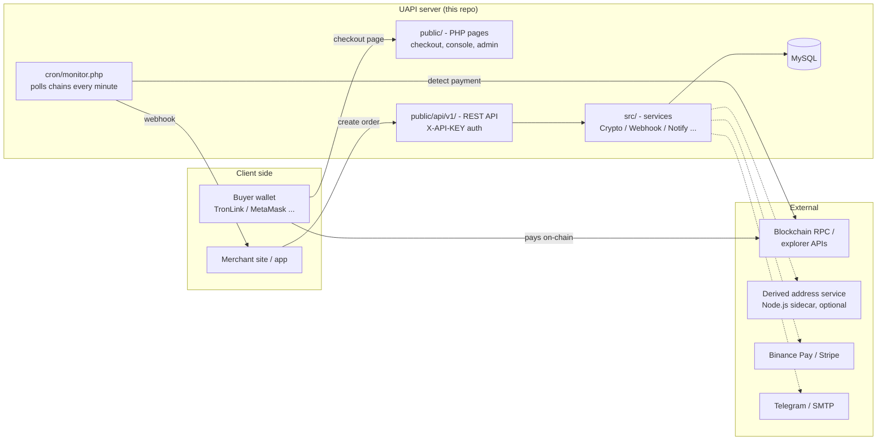

# UAPI — Self-Hosted Crypto Payment Gateway

**English** | [简体中文](README.zh-CN.md)

[](LICENSE)
[](https://php.net)
[](https://dev.mysql.com)
[](https://tailwindcss.com)

> ⚠️ **License notice**: The source code is published for **learning and research**. Any commercial use (paid services built on this project, resale, commercial production deployment, SaaS integration, etc.) requires **prior written commercial authorization** from the author. See [License](#license).

**UAPI** is a self-hosted, non-custodial cryptocurrency payment gateway written in plain PHP. You deploy it on your own server; merchants register on your instance, configure their own wallet addresses, and receive USDT/USDC payments directly to their wallets across multiple blockchains — the platform never holds funds. Binance Pay and Stripe are supported as alternative payment methods.

**Who is it for?**

- **Cross-border e-commerce / independent store owners** — take payments on your own site instead of a hosted payment processor, so no third party can freeze your funds or close your account
- **WooCommerce / self-hosted shop owners** — a ready-made WordPress plugin connects your store to your own gateway, no custom code required
- **SaaS, digital-goods and virtual-service developers** — a small REST API + webhooks to charge one-time payments or run subscription-style billing inside your own stack
- **Freelancers, studios and B2B exporters serving overseas clients** — get paid in USDT/USDC: settlement is fast and on-chain payments cannot be charged back
- **Membership communities and paid-content creators** — sell access with payment links, QR collection codes or the built-in store, no coding needed

> ⚖️ **Disclaimer**: This software touches cryptocurrency payments. It is provided "as is", without warranty. You are solely responsible for fund safety and legal/regulatory compliance (licensing, AML/KYC, etc.) in your jurisdiction.

## Table of Contents

- [Features](#features)
- [Architecture](#architecture)
- [Requirements](#requirements)
- [Installation](#installation)
  - [Option A — BT Panel (aaPanel/宝塔) one-click script](#option-a--bt-panel-aapanel宝塔-one-click-script)
  - [Option B — Manual: Nginx + PHP-FPM + MySQL](#option-b--manual-nginx--php-fpm--mysql)
  - [Option C — CLI installer](#option-c--cli-installer)
- [First Login (Important)](#first-login-important)
- [Usage](#usage)
  - [1. Admin: configure the platform](#1-admin-configure-the-platform)
  - [2. Merchant: get an API key](#2-merchant-get-an-api-key)
  - [3. Create an order via API](#3-create-an-order-via-api)
  - [4. Check order status](#4-check-order-status)
  - [5. Receive and verify webhooks](#5-receive-and-verify-webhooks)
  - [6. Plugins and integrations](#6-plugins-and-integrations)
- [Cron Jobs](#cron-jobs)
- [Derived Address Service (optional)](#derived-address-service-optional)
- [Building Tailwind CSS](#building-tailwind-css)
- [Project Structure](#project-structure)
- [FAQ](#faq)
- [Third-Party Components](#third-party-components)
- [License](#license)
- [Support](#support)

---

## Features

### Payments

- **Non-custodial** — funds go straight to the merchant's own wallet; the platform never holds money
- **Multi-chain** — TRC20 (Tron), BSC, Ethereum, Polygon, Optimism, Arbitrum, Base, Avalanche
- **Stablecoins** — USDT and USDC
- **Alternative rails** — Binance Pay and Stripe (card payments)
- **Per-order derived addresses** (optional) — unique EVM receive address per order via a Node.js sidecar
- **Instant webhooks** — HMAC-SHA256-signed callbacks with automatic retries

### Merchant console

- Real-time dashboard, order management, CSV export
- Payment links and QR collection codes (no coding required)
- Simple built-in online store with coupons and receipts
- Ticket system, in-app / Telegram / email notifications
- TOTP two-factor authentication (Google Authenticator compatible)
- Multi-language UI: English, 简体中文, 繁體中文, 日本語

### Admin panel

- User, plan (subscription tier), and order management
- Chain / wallet / payment-method configuration
- Webhook logs, API stats, security controls, announcements & broadcast
- Revenue reports and referral program management

---

## Architecture



Request flow in short: the merchant server calls `POST /api/v1/order/create.php` → UAPI returns a `payment_url` → the buyer pays on-chain from any wallet → `cron/monitor.php` detects the transaction → the order flips to `paid`, a signed webhook is POSTed to the merchant's `notify_url`, and notifications go out.

There is no PHP framework and no Composer autoloader: every page under `public/` bootstraps via `require_once`, and the database schema is created/updated automatically by the built-in Migrator.

---

## Requirements

| Component | Version | Notes |
|-----------|---------|-------|
| PHP | **8.0+** | The code uses PHP 8.0 syntax (`match`, `str_starts_with`, ...). Extensions: `pdo_mysql`, `curl`, `mbstring`, `gd`, `openssl`, `json` |
| MySQL / MariaDB | 5.7+ / 10.3+ | utf8mb4 |
| Web server | Nginx or Apache | Document root must point to `public/` |
| Node.js | 16+ (optional) | Only needed to rebuild Tailwind CSS or to run the derived-address sidecar |

No Composer required — PHPMailer is vendored in `PHPMailer/`.

---

## Installation

There are three ways to install. All of them end in the same state: tables created by the built-in Migrator and a default admin account seeded.

> ℹ️ **How initialization works**: database tables are created automatically by the built-in Migrator — either on the first HTTP request to the app, or explicitly via `php scripts/install.php`. The first migration also seeds a default admin account (email `admin@example.com`, password `admin123`) and the 8 supported chains with their plan mappings, so a fresh install works out of the box.

### Option A — BT Panel (aaPanel/宝塔) one-click script

If your server runs BT Panel (宝塔面板) with PHP 8.0+ and MySQL already installed:

```bash
cd /www/wwwroot
git clone https://github.com/jasonpan168/uapi.git uapi
cd uapi
bash scripts/bt_init.sh
```

The script:

1. Creates the MySQL database and a dedicated DB user with a **randomly generated password**
2. Writes `.env` / `config/db.php` for you
3. Calls `scripts/install.php` to create all tables and seed the default admin

If a `.env` already exists, the script refuses to run (to avoid clobbering a live install) — re-run with `FORCE=1 bash scripts/bt_init.sh` to overwrite deliberately.

Then, in the BT Panel UI, create a site whose document root is `/www/wwwroot/uapi/public` (PHP 8.0+), and set up the [cron jobs](#cron-jobs). Done — log in at `https://your-domain.com/admin/` (see [First Login](#first-login-important)).

### Option B — Manual: Nginx + PHP-FPM + MySQL

Every step below is copy-pasteable on Ubuntu 22.04 / Debian 12. Adjust the PHP version suffix (`8.2` here) to whatever you installed.

**1. Install packages**

```bash
apt update
apt install -y nginx mysql-server \
  php8.2-fpm php8.2-mysql php8.2-curl php8.2-gd php8.2-mbstring php8.2-xml
```

**2. Get the code**

```bash
mkdir -p /var/www/uapi
git clone https://github.com/jasonpan168/uapi.git /var/www/uapi
```

**3. Create the database**

```bash
mysql -u root -p <<'SQL'
CREATE DATABASE uapi_db CHARACTER SET utf8mb4 COLLATE utf8mb4_unicode_ci;
CREATE USER 'uapi'@'localhost' IDENTIFIED BY 'REPLACE_WITH_A_STRONG_PASSWORD';
GRANT ALL PRIVILEGES ON uapi_db.* TO 'uapi'@'localhost';
FLUSH PRIVILEGES;
SQL
```

**4. Configure the environment**

```bash
cd /var/www/uapi
cp .env.example .env
```

Edit `.env` — at minimum the DB block:

```env
DB_HOST=127.0.0.1
DB_PORT=3306
DB_NAME=uapi_db
DB_USER=uapi
DB_PASS=REPLACE_WITH_A_STRONG_PASSWORD
```

**5. Initialize the database (recommended, or let the first HTTP request do it)**

```bash
php scripts/install.php
```

**6. Configure Nginx**

Create `/etc/nginx/sites-available/uapi`:

```nginx
server {
    listen 80;
    server_name your-domain.com;
    root /var/www/uapi/public;
    index index.php;

    location / {
        try_files $uri $uri/ /index.php?$query_string;
    }

    location ~ \.php$ {
        fastcgi_pass unix:/run/php/php8.2-fpm.sock;
        fastcgi_index index.php;
        include fastcgi_params;
        fastcgi_param SCRIPT_FILENAME $document_root$fastcgi_script_name;
    }

    location ~ /\. {
        deny all;
    }
}
```

```bash
ln -s /etc/nginx/sites-available/uapi /etc/nginx/sites-enabled/
nginx -t && systemctl reload nginx
```

> `config/`, `src/`, `cron/`, `lang/` live **outside** the document root, so they are not web-accessible as long as root points to `public/`.

**7. Permissions**

```bash
chown -R www-data:www-data /var/www/uapi
chmod 600 /var/www/uapi/.env
```

**8. HTTPS (strongly recommended for a payment system)**

```bash
apt install -y certbot python3-certbot-nginx
certbot --nginx -d your-domain.com
```

**9. Set up [cron jobs](#cron-jobs)** — without `cron/monitor.php`, payments are never detected.

### Option C — CLI installer

If you already have PHP + MySQL and just want to initialize the app (e.g. in a container or an existing web stack):

```bash
git clone https://github.com/jasonpan168/uapi.git
cd uapi
cp .env.example .env      # then edit the DB_* values
php scripts/install.php
```

`scripts/install.php` reads `.env`, connects to MySQL, runs the full Migrator (creates every table, seeds the 8 supported chains), and seeds the default admin account. It is idempotent — safe to run again after an upgrade.

---

## First Login (Important)

After installation, open the login page:

```
https://your-domain.com/login.php
```

Sign in with the seeded default administrator (login is by **email**, not username):

| Email | Password |
|-------|----------|
| `admin@example.com` | `admin123` |

After login you are taken to the admin panel at `/admin/`.

> 🚨 **SECURITY WARNING — do this before anything else**
>
> `admin@example.com` / `admin123` is a publicly known default. **Change the password immediately after your first login** (and preferably enable 2FA). Anyone who logs in with the default credentials before you change them owns your gateway.

Merchants register and log in on the same pages (`/register.php`, `/login.php`).

---

## Usage

### 1. Admin: configure the platform

In the admin panel (`/admin/`):

1. **System settings** (`/admin/settings.php`) — site name, logo, SEO, SMTP for outgoing mail. (Note: merchant logo uploads accept PNG/JPG/WebP — SVG is not allowed.)
2. **Plans** (`/admin/plans.php`) — subscription tiers control which chains, rate limits, and features (e.g. webhook notifications) each merchant gets.
3. **Payment configuration** — platform-level wallets / fee addresses, Binance Pay merchant credentials, Stripe API keys (each optional). If you enable Stripe, `stripe_webhook_secret` (`whsec_...`) is mandatory: `/api/v1/stripe/webhook.php` answers `503` and processes nothing until it is set, so forged payment events cannot be accepted.
4. **Users** (`/admin/users.php`) — manage merchants, balances, API keys.

Merchants configure their **own receiving wallet addresses** per chain in the console under *Settings → Wallets*.

### 2. Merchant: get an API key

1. Register / log in to the console
2. *Settings → API settings* → **Generate API Key** — the `sk_live_...` key is shown **once**; store it safely
3. Bind your website domain(s) under *Websites*. Browser-originated API calls are validated against the bound domains; server-to-server calls pass `"domain"` in the request body instead.

### 3. Create an order via API

The primary integration endpoint. Full, always-current API reference is served by your own instance at `https://your-domain.com/doc.php`, and in [docs/API.md](docs/API.md).

**Endpoint:** `POST /api/v1/order/create.php` — auth via `X-API-KEY` header.

| Parameter | Required | Description |
|-----------|----------|-------------|
| `amount` | yes | Order amount (in USDT/USDC) |
| `chain` | yes | `trc20` / `bsc` / `eth` / `polygon` / `optimism` / `arbitrum` / `base` / `avalanche` |
| `merchant_order_id` | yes | Your unique order ID (idempotency key) |
| `currency` | no | `USDT` (default) or `USDC` |
| `notify_url` | no | Webhook URL called when the order is paid |
| `domain` | server-to-server | Must be a domain bound to your account |

**cURL**

```bash
curl -X POST https://your-domain.com/api/v1/order/create.php \
  -H "X-API-KEY: sk_live_your_api_key" \
  -H "Content-Type: application/json" \
  -d '{
    "amount": 100.00,
    "chain": "trc20",
    "currency": "USDT",
    "merchant_order_id": "ORD-1001",
    "notify_url": "https://your-shop.com/uapi-webhook.php",
    "domain": "your-shop.com"
  }'
```

**Node.js**

```javascript
const response = await fetch('https://your-domain.com/api/v1/order/create.php', {
  method: 'POST',
  headers: {
    'X-API-KEY': 'sk_live_your_api_key',
    'Content-Type': 'application/json'
  },
  body: JSON.stringify({
    amount: 100.00,
    chain: 'trc20',
    currency: 'USDT',
    merchant_order_id: 'ORD-1001',
    notify_url: 'https://your-shop.com/uapi-webhook',
    domain: 'your-shop.com'
  })
});

const result = await response.json();
if (result.status === 'success') {
  // redirect the buyer to the hosted checkout page
  console.log(result.data.payment_url);
} else {
  console.error(result.error);
}
```

**PHP**

```php
<?php
$ch = curl_init('https://your-domain.com/api/v1/order/create.php');
curl_setopt_array($ch, [
    CURLOPT_HTTPHEADER => [
        'X-API-KEY: sk_live_your_api_key',
        'Content-Type: application/json',
    ],
    CURLOPT_POST => true,
    CURLOPT_POSTFIELDS => json_encode([
        'amount'            => 100.00,
        'chain'             => 'trc20',
        'currency'          => 'USDT',
        'merchant_order_id' => 'ORD-1001',
        'notify_url'        => 'https://your-shop.com/uapi-webhook.php',
        'domain'            => 'your-shop.com',
    ]),
    CURLOPT_RETURNTRANSFER => true,
]);
$result = json_decode(curl_exec($ch), true);

if (($result['status'] ?? '') === 'success') {
    header('Location: ' . $result['data']['payment_url']); // send buyer to checkout
    exit;
}
echo 'Error: ' . ($result['error'] ?? 'unknown');
```

**Response**

```json
{
  "status": "success",
  "data": {
    "order_no": "UAPI20260408001",
    "amount": 100.00,
    "currency": "USDT",
    "chain": "trc20",
    "expire_in": 600,
    "payment_url": "https://your-domain.com/pay.php?order=UAPI20260408001&token=...",
    "fast_sync_enabled": false
  }
}
```

Notes:

- `expire_in` is a **relative TTL in seconds** (default 600 = 10 minutes), not a timestamp.
- The field names are `order_no` / `currency` / `tx_hash` — not `order_id` / `token` / `txid`.
- Re-sending the same `merchant_order_id` returns the existing pending order (idempotent).

### 4. Check order status

`GET /api/v1/order/status.php?order_no=...&token=...` — authenticated by the **per-order `token`** embedded in `payment_url` (not by your API key). It is designed for checkout-page polling; server-side integrations should rely on webhooks instead.

```bash
curl -G https://your-domain.com/api/v1/order/status.php \
  -d "order_no=UAPI20260408001" \
  -d "token=TOKEN_FROM_PAYMENT_URL"
# → {"status":"paid","tx_hash":"..."} / {"status":"pending"} / {"status":"expired"}
```

### 5. Receive and verify webhooks

When an order is paid, UAPI POSTs a JSON body to your `notify_url`, retrying up to 3 times (10 s timeout, backoff) until your endpoint returns HTTP 2xx (or the literal body `success`).

**Headers**

| Header | Meaning |
|--------|---------|
| `X-UAPI-Signature` | HMAC-SHA256 hex digest (no `sha256=` prefix) |
| `X-UAPI-Timestamp` | Unix timestamp (seconds), part of the signed input |
| `X-UAPI-Event` | Currently always `order.paid` |
| `X-UAPI-Event-ID` | Unique event ID — stable across retries, use it for idempotency |

**Body** (flat JSON, no `event`/`data` nesting)

```json
{
  "status": "paid",
  "order_no": "UAPI20260408001",
  "merchant_order_id": "ORD-1001",
  "amount": "100.00",
  "chain": "trc20",
  "currency": "USDT",
  "tx_hash": "0xabc...",
  "paid_at": "2026-04-08T10:05:00+00:00"
}
```

**Signature** = `HMAC_SHA256(order_no + amount + merchant_order_id + timestamp, your_api_key)`. The key is your **API key** — there is no separate webhook secret.

```php
<?php
// uapi-webhook.php
$payload   = json_decode(file_get_contents('php://input'), true);
$signature = $_SERVER['HTTP_X_UAPI_SIGNATURE'] ?? '';
$timestamp = $_SERVER['HTTP_X_UAPI_TIMESTAMP'] ?? '';
$apiKey    = 'sk_live_your_api_key';

// 1. Reject stale signatures (replay protection)
if (abs(time() - (int)$timestamp) > 300) {
    http_response_code(401);
    exit('Stale timestamp');
}

// 2. Verify the HMAC
$signInput = $payload['order_no'] . $payload['amount']
           . $payload['merchant_order_id'] . $timestamp;
if (!hash_equals(hash_hmac('sha256', $signInput, $apiKey), $signature)) {
    http_response_code(401);
    exit('Invalid signature');
}

// 3. Idempotency: skip events you have already processed
//    (use $_SERVER['HTTP_X_UAPI_EVENT_ID'])

// 4. Business logic
if (($payload['status'] ?? '') === 'paid') {
    // mark $payload['merchant_order_id'] as paid, store $payload['tx_hash'] ...
}

http_response_code(200);
echo 'success';
```

### 6. Plugins and integrations

- **WordPress / WooCommerce** — a ready-made payment plugin ships with every deployment (download it from `/plugins.php` on your instance; source under `public/downloads/uapi-payment/`). It adds paid posts, paid downloads, products and payment links to WordPress sites.
- **In-app developer docs** — every deployment serves interactive API documentation at `/doc.php`.
- **No-code options** — payment links, QR collection codes, and the built-in store all work without any API integration.

---

## Cron Jobs

Two cron entries are required for the gateway to function; a third script exists for manual upgrades.

| Script | Schedule | Purpose |
|--------|----------|---------|
| `cron/monitor.php` | **every minute** | Polls blockchain RPC/explorer APIs for pending orders; marks them paid, fires webhooks and notifications. Self-locking (`flock`), so overlapping runs are safe. Also watches the cleanup heartbeat and raises an alert if it goes stale. |
| `cron/cleanup.php` | hourly | Purges old logs (7-day retention), expired orders and temporary data; writes a heartbeat. |
| `cron/upgrade_db.php` | manual only | Heavy one-off migrations for major upgrades. Run by hand: `php cron/upgrade_db.php`. |

Crontab example (`crontab -e` as the web user or root):

```cron
* * * * * cd /var/www/uapi && php cron/monitor.php >> /var/log/uapi-monitor.log 2>&1
0 * * * * cd /var/www/uapi && php cron/cleanup.php >> /var/log/uapi-cleanup.log 2>&1
```

Both scripts refuse to run outside the CLI, so they cannot be triggered over HTTP.

---

## Derived Address Service (optional)

By default all orders on a chain share the merchant's fixed wallet address, and payment matching is amount-based. If you enable **derived mode** (`merchant_receive_mode = derived`), each order gets a unique receive address derived from an xpub — this requires the Node.js sidecar in `scripts/derived-address-service/`:

```bash
cd scripts/derived-address-service
npm install                     # has its own node_modules, separate from the repo root

DERIVED_ADDR_SERVICE_TOKEN='a-long-random-shared-secret' HOST=127.0.0.1 PORT=8787 \
  pm2 start server.mjs --name uapi-derived-address
```

- **EVM chains only** (eth / bsc / polygon / optimism / arbitrum / base / avalanche). TRC20 always uses fixed addresses.
- The `DERIVED_ADDR_SERVICE_TOKEN` in `.env` must match the token passed to the Node process byte-for-byte, and the service should only listen on localhost.
- Endpoints: `GET /healthz`, `POST /v1/derive` (auth via `X-Api-Key` header). See `scripts/derived-address-service/README.md`.
- An offline transaction signer for derived wallets ships at `public/tools/derived_offline_signer.html`.

If you never use derived mode, you can ignore this service entirely.

---

## Building Tailwind CSS

A prebuilt `public/output.css` is committed, so **you only need this when changing the UI**:

```bash
npm install

npm run build:css    # production build (minified)
npm run watch:css    # rebuild on change during development
```

Tailwind scans the PHP templates (see `tailwind.config.js`) and writes `public/output.css`.

There is no automated test suite (`npm test` is a placeholder).

---

## Project Structure

```
uapi/
├── public/                  # Document root (the ONLY web-accessible directory)
│   ├── api/v1/              # REST API: order/, user/, store/, chain/, binance/, stripe/
│   ├── admin/               # Admin panel
│   ├── inc/bootstrap.php    # Session + config + DB + i18n bootstrap
│   ├── includes/            # Shared HTML partials
│   ├── tools/               # Offline signer, vanity address generator (static HTML)
│   ├── doc.php              # Interactive API documentation
│   └── *.php                # Merchant console & checkout pages
├── src/                     # PHP classes (no autoloader; loaded via require_once)
│   ├── Core/                # Database (PDO singleton + Migrator), I18n, Http
│   ├── Services/            # CryptoService, WebhookService, BinancePayService,
│   │                        # StripeService, NotificationDispatcher, 2FA, ...
│   ├── Admin/AdminAuth.php  # Admin session auth
│   └── Helper.php           # e(), getSetting(), CSRF helpers, jsonResponse()
├── config/config.php        # Config loader + $chains_config (chain/token contracts)
├── cron/                    # monitor.php / cleanup.php / upgrade_db.php
├── scripts/
│   ├── install.php          # CLI installer (reads .env → creates tables → seeds admin)
│   ├── bt_init.sh           # BT Panel one-click bootstrap (calls install.php)
│   └── derived-address-service/  # Node.js sidecar for per-order addresses
├── lang/                    # en, zh-cn, zh-tw, ja translations
├── PHPMailer/               # Vendored PHPMailer (no Composer needed)
├── docs/                    # QUICKSTART, DEPLOYMENT, API, DEVELOPER, ADMIN, USER guides
└── .env.example             # Environment template
```

**Environment variables** (`.env`):

| Variable | Required | Description |
|----------|----------|-------------|
| `DB_HOST` / `DB_PORT` / `DB_NAME` / `DB_USER` / `DB_PASS` | yes | MySQL connection (defaults: `uapi_db` / `uapi`) |
| `DERIVED_ADDR_SERVICE_URL` | derived mode only | e.g. `http://127.0.0.1:8787` |
| `DERIVED_ADDR_SERVICE_TOKEN` | derived mode only | Shared secret with the Node sidecar |
| `DERIVED_ADDR_SERVICE_TIMEOUT` | no | Seconds, default 5 |
| `MAIL_HOST` / `MAIL_PORT` / `MAIL_USER` / `MAIL_PASS` / `MAIL_FROM_*` | no | System SMTP fallback (can also be set in the admin UI) |

---

## FAQ

**Q: Does the platform hold customer funds?**
No. Payments go directly on-chain to the wallet address the merchant configured. There is nothing to withdraw from the platform itself.

**Q: How long does a buyer have to pay?**
Orders expire after the TTL returned in `expire_in` (600 seconds by default). Expired orders are invalidated automatically.

**Q: How fast are payments detected?**
`cron/monitor.php` runs every minute, so typically within 1–3 minutes depending on chain confirmation times.

**Q: Is there a sandbox / test endpoint?**
No. There is no test-order API. To verify an integration end-to-end, create a small real order (e.g. 1 USDT on a low-fee chain such as TRC20 or BSC) and pay it.

**Q: Which PHP versions work?**
PHP 8.0 or newer. The code uses PHP 8.0 language features (`match`, `str_starts_with`), so PHP 7.x will not run.

**Q: How do I upgrade an existing installation?**
Back up your database, `git pull`, then run `php scripts/install.php` (idempotent) — and `php cron/upgrade_db.php` if the release notes ask for it. Routine schema evolution is handled automatically by the Migrator on page load.

**Q: Webhooks are not arriving. What do I check?**
1) `notify_url` is publicly reachable over HTTPS; 2) your firewall allows outbound/inbound traffic; 3) the merchant's plan allows webhook notifications; 4) the webhook logs in the admin panel (`/admin/webhook_logs.php`); 5) your endpoint returns HTTP 2xx.

**Q: USDC on TRC20 fails.**
Currency/chain combinations are restricted by configuration; USDC is primarily supported on EVM chains. Use USDT on TRC20 or switch chains.

**Q: Are there automated tests?**
No. There is no test suite in this repository; validate changes manually before deploying to production.

---

## Third-Party Components

This project stands on excellent open-source software. Each component keeps its own license, which is **not** overridden by this project's licensing:

| Component | Use | License |
|-----------|-----|---------|
| [PHPMailer](https://github.com/PHPMailer/PHPMailer) 6.9.x | Email (vendored in `PHPMailer/`) | LGPL-2.1 |
| [ethers.js](https://github.com/ethers-io/ethers.js) 6.13.x | Address derivation / offline signing | MIT |
| [Tailwind CSS](https://github.com/tailwindlabs/tailwindcss) 3.4 | UI styles | MIT |
| [Bootstrap](https://github.com/twbs/bootstrap) 5.3, [Chart.js](https://github.com/chartjs/Chart.js), [Apache ECharts](https://github.com/apache/echarts), [highlight.js](https://github.com/highlightjs/highlight.js), [html2canvas](https://github.com/niklasvh/html2canvas), [qrcode.js](https://github.com/davidshimjs/qrcodejs), [canvas-confetti](https://github.com/catdad/canvas-confetti), [Font Awesome Free](https://github.com/FortAwesome/Font-Awesome), [cryptocurrency-icons](https://github.com/atomiclabs/cryptocurrency-icons) | Frontend (CDN) | MIT / Apache-2.0 / BSD / CC |

If you use this project commercially, verify the commercial compliance of these components as well.

---

## License

**GNU AGPLv3 + additional commercial terms** (dual licensing). Full text in [LICENSE](LICENSE).

Copyright © 2026 The UAPI Authors

| Use case | Allowed? | Conditions |
|----------|----------|------------|
| Personal learning, research, security assessment | ✅ | AGPLv3 |
| Non-commercial self-hosted testing | ✅ | AGPLv3 |
| Modification, forks, redistribution | ✅ | AGPLv3 (network use requires source disclosure, §13), keep copyright & repo link |
| **Any commercial use** (paid services, production operation, resale, embedding in commercial products/SaaS) | ⚠️ **Paid license required** | Prior **written** authorization from the author |

In short: **free for learning and research; commercial use requires a paid license.**

💬 Commercial licensing / cooperation: please [open a GitHub issue](https://github.com/jasonpan168/uapi/issues).
🔒 Found a security problem? Do not open an issue — [report it privately here](https://github.com/jasonpan168/uapi/security/advisories/new).

---

## Support

- 📖 Documentation: [docs/](docs/README.md) directory, or `/doc.php` on your running instance
- 🐛 Bugs: [GitHub Issues](https://github.com/jasonpan168/uapi/issues) (see [SUPPORT.md](SUPPORT.md))
- 🔐 Security vulnerabilities: report privately via [GitHub Security Advisories](https://github.com/jasonpan168/uapi/security/advisories/new) — see [SECURITY.md](SECURITY.md)
- 🤝 Contributing: [CONTRIBUTING.md](CONTRIBUTING.md)

---

*UAPI — free for learning and research; commercial use requires a paid license.*
