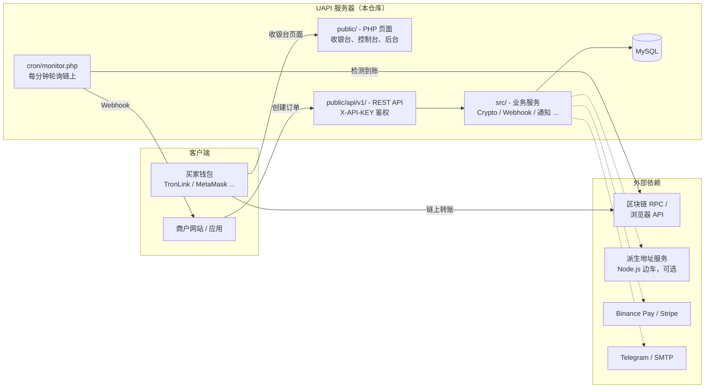

# UAPI — 自托管加密货币支付网关

[English](README.md) | **简体中文**

[](LICENSE)
[](https://php.net)
[](https://dev.mysql.com)
[](https://tailwindcss.com)

> ⚠️ **授权说明**：本项目源码公开**仅供学习与研究**。任何商业用途（对外收费服务、二次销售、商业生产部署、集成进商业产品/SaaS 等）**须事先获得作者书面付费授权**。详见 [许可证](#许可证)。

**UAPI** 是一个用原生 PHP 编写的自托管、非托管型加密货币支付网关。你把它部署在自己的服务器上；商户在你的实例上注册、配置自己的钱包地址，通过多条区块链直接收取 USDT/USDC —— 资金直达商户钱包，平台不经手。另支持 Binance Pay 和 Stripe 作为替代支付方式。

**适合谁？**

- **跨境电商 / 独立站卖家** —— 在自己的网站上直接收款，不依赖第三方支付托管，不存在被冻结资金、封禁账户的风险
- **WooCommerce / 自托管商城站长** —— 现成的 WordPress 插件，无需写代码即可把商城接入自己的网关
- **SaaS / 数字商品 / 虚拟服务开发者** —— 简洁的 REST API + Webhook，一次性付款和订阅式收费都能接
- **面向海外客户的自由职业者、工作室、外贸 B2B** —— 用 USDT/USDC 收款，到账快、无拒付（链上支付不可撤销）
- **社群会员、内容付费运营者** —— 支付链接、收款码、内置商店开箱即用，零代码收款

> ⚖️ **免责声明**：本软件涉及加密货币支付，按"现状"提供，不附带任何担保。资金安全与所在司法辖区的合规义务（牌照、反洗钱、实名认证等）由使用者自行承担。

## 目录

- [功能特性](#功能特性)
- [架构简图](#架构简图)
- [系统要求](#系统要求)
- [安装教程](#安装教程)
  - [方式 A — 宝塔面板一键脚本](#方式-a--宝塔面板一键脚本)
  - [方式 B — 手动部署：Nginx + PHP-FPM + MySQL](#方式-b--手动部署nginx--php-fpm--mysql)
  - [方式 C — CLI 安装器](#方式-c--cli-安装器)
- [首次登录（重要）](#首次登录重要)
- [使用方式](#使用方式)
  - [1. 管理员：配置平台](#1-管理员配置平台)
  - [2. 商户：获取 API Key](#2-商户获取-api-key)
  - [3. 通过 API 创建订单](#3-通过-api-创建订单)
  - [4. 查询订单状态](#4-查询订单状态)
  - [5. 接收并验签 Webhook](#5-接收并验签-webhook)
  - [6. 插件与集成](#6-插件与集成)
- [定时任务](#定时任务)
- [派生地址服务（可选）](#派生地址服务可选)
- [Tailwind CSS 构建](#tailwind-css-构建)
- [项目结构](#项目结构)
- [常见问题](#常见问题)
- [第三方开源组件](#第三方开源组件)
- [许可证](#许可证)
- [支持](#支持)

---

## 功能特性

### 支付能力

- **非托管** —— 资金直接进入商户自己的钱包，平台从不经手
- **多链支持** —— TRC20（Tron）、BSC、Ethereum、Polygon、Optimism、Arbitrum、Base、Avalanche
- **稳定币** —— USDT、USDC
- **替代支付** —— Binance Pay、Stripe（信用卡）
- **每单派生地址**（可选）—— 通过 Node.js 边车服务从 xpub 为每笔订单派生唯一 EVM 收款地址
- **即时 Webhook** —— HMAC-SHA256 签名回调，自动重试

### 商户控制台

- 实时仪表板、订单管理、CSV 导出
- 支付链接与收款码（零代码收款）
- 内置简易在线商店，支持优惠券与收据
- 工单系统，站内 / Telegram / 邮件通知
- TOTP 双因素认证（兼容 Google Authenticator）
- 多语言界面：English、简体中文、繁體中文、日本語

### 管理后台

- 用户、套餐（订阅等级）、订单管理
- 链 / 钱包 / 支付方式配置
- Webhook 日志、API 统计、安全控制、公告与广播
- 收入报表与推荐返利管理

---

## 架构简图



一句话流程：商户服务器调用 `POST /api/v1/order/create.php` → UAPI 返回 `payment_url` → 买家用任意钱包链上转账 → `cron/monitor.php` 检测到交易 → 订单变为 `paid`，向商户 `notify_url` 发送签名 Webhook 并推送通知。

项目不使用 PHP 框架、没有 Composer 自动加载：`public/` 下每个页面通过 `require_once` 引导，数据表由内置 Migrator 自动创建与演进。

---

## 系统要求

| 组件 | 版本 | 说明 |
|------|------|------|
| PHP | **8.0+** | 代码使用了 PHP 8.0 语法（`match`、`str_starts_with` 等）。扩展：`pdo_mysql`、`curl`、`mbstring`、`gd`、`openssl`、`json` |
| MySQL / MariaDB | 5.7+ / 10.3+ | utf8mb4 |
| Web 服务器 | Nginx 或 Apache | 站点根目录必须指向 `public/` |
| Node.js | 16+（可选） | 仅在重新构建 Tailwind CSS 或运行派生地址边车时需要 |

无需 Composer —— PHPMailer 已内置于 `PHPMailer/` 目录。

---

## 安装教程

三种安装方式殊途同归：数据表由内置 Migrator 创建，并播种默认管理员账户。

> ℹ️ **初始化机制**：数据表由内置 Migrator 自动创建 —— 首次 HTTP 访问时自动执行，也可以用 `php scripts/install.php` 显式执行。首次迁移会同时播种默认管理员账户（邮箱 `admin@example.com`，密码 `admin123`），并自动创建 chains / plan_chains 表、播种 8 条链数据，全新安装开箱即用。

### 方式 A — 宝塔面板一键脚本

如果你的服务器已装宝塔面板（含 PHP 8.0+ 与 MySQL）：

```bash
cd /www/wwwroot
git clone https://github.com/jasonpan168/uapi.git uapi
cd uapi
bash scripts/bt_init.sh
```

脚本会：

1. 创建 MySQL 数据库和专用数据库用户（**密码随机生成**）
2. 自动写好 `.env` / `config/db.php`
3. 调用 `scripts/install.php` 建表并播种默认管理员

如果 `.env` 已存在，脚本会拒绝执行（防止覆盖已上线的安装）—— 确认要覆盖时用 `FORCE=1 bash scripts/bt_init.sh` 重跑。

然后在宝塔面板里新建站点，根目录指向 `/www/wwwroot/uapi/public`（PHP 8.0+），并配置好[定时任务](#定时任务)。完成后访问 `https://your-domain.com/admin/` 登录（见[首次登录](#首次登录重要)）。

### 方式 B — 手动部署：Nginx + PHP-FPM + MySQL

以下命令在 Ubuntu 22.04 / Debian 12 上可直接复制执行。PHP 版本后缀（示例为 `8.2`）按实际安装调整。

**1. 安装软件包**

```bash
apt update
apt install -y nginx mysql-server \
  php8.2-fpm php8.2-mysql php8.2-curl php8.2-gd php8.2-mbstring php8.2-xml
```

**2. 拉取代码**

```bash
mkdir -p /var/www/uapi
git clone https://github.com/jasonpan168/uapi.git /var/www/uapi
```

**3. 创建数据库**

```bash
mysql -u root -p <<'SQL'
CREATE DATABASE uapi_db CHARACTER SET utf8mb4 COLLATE utf8mb4_unicode_ci;
CREATE USER 'uapi'@'localhost' IDENTIFIED BY '换成强密码';
GRANT ALL PRIVILEGES ON uapi_db.* TO 'uapi'@'localhost';
FLUSH PRIVILEGES;
SQL
```

**4. 配置环境变量**

```bash
cd /var/www/uapi
cp .env.example .env
```

编辑 `.env`，至少填好数据库部分：

```env
DB_HOST=127.0.0.1
DB_PORT=3306
DB_NAME=uapi_db
DB_USER=uapi
DB_PASS=换成强密码
```

**5. 初始化数据库（推荐显式执行；不执行则首次 HTTP 访问时自动迁移）**

```bash
php scripts/install.php
```

**6. 配置 Nginx**

创建 `/etc/nginx/sites-available/uapi`：

```nginx
server {
    listen 80;
    server_name your-domain.com;
    root /var/www/uapi/public;
    index index.php;

    location / {
        try_files $uri $uri/ /index.php?$query_string;
    }

    location ~ \.php$ {
        fastcgi_pass unix:/run/php/php8.2-fpm.sock;
        fastcgi_index index.php;
        include fastcgi_params;
        fastcgi_param SCRIPT_FILENAME $document_root$fastcgi_script_name;
    }

    location ~ /\. {
        deny all;
    }
}
```

```bash
ln -s /etc/nginx/sites-available/uapi /etc/nginx/sites-enabled/
nginx -t && systemctl reload nginx
```

> `config/`、`src/`、`cron/`、`lang/` 都在站点根目录**之外**，只要根目录指向 `public/`，这些目录就不会被 Web 访问到。

**7. 设置权限**

```bash
chown -R www-data:www-data /var/www/uapi
chmod 600 /var/www/uapi/.env
```

**8. 配置 HTTPS（支付系统强烈建议）**

```bash
apt install -y certbot python3-certbot-nginx
certbot --nginx -d your-domain.com
```

**9. 配置[定时任务](#定时任务)** —— 不配 `cron/monitor.php` 就永远检测不到支付。

### 方式 C — CLI 安装器

如果你已有 PHP + MySQL 环境，只想初始化应用（如容器或既有 Web 栈中）：

```bash
git clone https://github.com/jasonpan168/uapi.git
cd uapi
cp .env.example .env      # 然后编辑 DB_* 配置
php scripts/install.php
```

`scripts/install.php` 读取 `.env`、连接 MySQL、执行完整 Migrator（创建全部数据表、播种 8 条链数据）并播种默认管理员。脚本幂等，升级后重复执行是安全的。

---

## 首次登录（重要）

安装完成后访问登录页：

```
https://your-domain.com/login.php
```

用播种的默认管理员登录（登录凭据是**邮箱**，不是用户名）：

| 邮箱 | 密码 |
|------|------|
| `admin@example.com` | `admin123` |

登录后会进入 `/admin/` 管理后台。

> 🚨 **安全警告 —— 登录后第一件事**
>
> `admin@example.com` / `admin123` 是公开的默认凭据。**首次登录后必须立即修改密码**（最好同时开启 2FA）。在你改密码之前，任何人用默认凭据登录都能接管你的网关。

商户在同样的页面注册和登录（`/register.php`、`/login.php`）。

---

## 使用方式

### 1. 管理员：配置平台

在管理后台（`/admin/`）：

1. **系统设置**（`/admin/settings.php`）—— 站点名称、Logo、SEO、系统 SMTP。（注意：商户 Logo 上传仅支持 PNG/JPG/WebP，不支持 SVG。）
2. **套餐管理**（`/admin/plans.php`）—— 套餐决定每个商户可用的链、频率限制和功能（如 Webhook 通知）。
3. **支付配置** —— 平台级钱包/手续费地址、Binance Pay 商户密钥、Stripe API Key（均可选）。
4. **用户管理**（`/admin/users.php`）—— 管理商户、余额、API Key。

商户在控制台「设置 → 钱包设置」中配置**自己的**各链收款地址。

### 2. 商户：获取 API Key

1. 注册 / 登录控制台
2. 「设置 → API 设置」→ **生成 API Key** —— `sk_live_...` 密钥**仅显示一次**，请妥善保存
3. 在「网站绑定」中绑定业务域名。浏览器发起的 API 调用会校验来源域名；服务器对服务器调用改为在请求体传 `"domain"` 参数。

### 3. 通过 API 创建订单

核心集成端点。完整、随版本更新的 API 参考见你自己实例上的 `https://your-domain.com/doc.php`，以及 [docs/API.md](docs/API.md)。

**端点：** `POST /api/v1/order/create.php` —— 通过 `X-API-KEY` 请求头鉴权。

| 参数 | 必填 | 说明 |
|------|------|------|
| `amount` | 是 | 订单金额（USDT/USDC） |
| `chain` | 是 | `trc20` / `bsc` / `eth` / `polygon` / `optimism` / `arbitrum` / `base` / `avalanche` |
| `merchant_order_id` | 是 | 你的唯一订单号（幂等键） |
| `currency` | 否 | `USDT`（默认）或 `USDC` |
| `notify_url` | 否 | 支付成功后的 Webhook 回调地址 |
| `domain` | 服务器调用时必填 | 必须是账户已绑定的域名 |

**cURL**

```bash
curl -X POST https://your-domain.com/api/v1/order/create.php \
  -H "X-API-KEY: sk_live_your_api_key" \
  -H "Content-Type: application/json" \
  -d '{
    "amount": 100.00,
    "chain": "trc20",
    "currency": "USDT",
    "merchant_order_id": "ORD-1001",
    "notify_url": "https://your-shop.com/uapi-webhook.php",
    "domain": "your-shop.com"
  }'
```

**Node.js**

```javascript
const response = await fetch('https://your-domain.com/api/v1/order/create.php', {
  method: 'POST',
  headers: {
    'X-API-KEY': 'sk_live_your_api_key',
    'Content-Type': 'application/json'
  },
  body: JSON.stringify({
    amount: 100.00,
    chain: 'trc20',
    currency: 'USDT',
    merchant_order_id: 'ORD-1001',
    notify_url: 'https://your-shop.com/uapi-webhook',
    domain: 'your-shop.com'
  })
});

const result = await response.json();
if (result.status === 'success') {
  // 将买家重定向到托管收银台页面
  console.log(result.data.payment_url);
} else {
  console.error(result.error);
}
```

**PHP**

```php
<?php
$ch = curl_init('https://your-domain.com/api/v1/order/create.php');
curl_setopt_array($ch, [
    CURLOPT_HTTPHEADER => [
        'X-API-KEY: sk_live_your_api_key',
        'Content-Type: application/json',
    ],
    CURLOPT_POST => true,
    CURLOPT_POSTFIELDS => json_encode([
        'amount'            => 100.00,
        'chain'             => 'trc20',
        'currency'          => 'USDT',
        'merchant_order_id' => 'ORD-1001',
        'notify_url'        => 'https://your-shop.com/uapi-webhook.php',
        'domain'            => 'your-shop.com',
    ]),
    CURLOPT_RETURNTRANSFER => true,
]);
$result = json_decode(curl_exec($ch), true);

if (($result['status'] ?? '') === 'success') {
    header('Location: ' . $result['data']['payment_url']); // 跳转买家到收银台
    exit;
}
echo 'Error: ' . ($result['error'] ?? 'unknown');
```

**响应**

```json
{
  "status": "success",
  "data": {
    "order_no": "UAPI20260408001",
    "amount": 100.00,
    "currency": "USDT",
    "chain": "trc20",
    "expire_in": 600,
    "payment_url": "https://your-domain.com/pay.php?order=UAPI20260408001&token=...",
    "fast_sync_enabled": false
  }
}
```

注意：

- `expire_in` 是**相对有效期（秒）**（默认 600 = 10 分钟），不是时间戳。
- 字段名是 `order_no` / `currency` / `tx_hash` —— 不是 `order_id` / `token` / `txid`。
- 重复提交同一个 `merchant_order_id` 会返回已存在的待支付订单（幂等）。

### 4. 查询订单状态

`GET /api/v1/order/status.php?order_no=...&token=...` —— 用 `payment_url` 里携带的**订单级 `token`** 鉴权（不是 API Key）。该端点设计给收银台页面轮询用；服务端集成应以 Webhook 为准。

```bash
curl -G https://your-domain.com/api/v1/order/status.php \
  -d "order_no=UAPI20260408001" \
  -d "token=从payment_url取的TOKEN"
# → {"status":"paid","tx_hash":"..."} / {"status":"pending"} / {"status":"expired"}
```

### 5. 接收并验签 Webhook

订单支付成功后，UAPI 会向 `notify_url` POST 一个 JSON 请求，最多重试 3 次（超时 10 秒，退避递增），直到你的端点返回 HTTP 2xx（或响应体为字面量 `success`）。

**请求头**

| Header | 含义 |
|--------|------|
| `X-UAPI-Signature` | HMAC-SHA256 十六进制签名（**无** `sha256=` 前缀） |
| `X-UAPI-Timestamp` | Unix 时间戳（秒），参与签名 |
| `X-UAPI-Event` | 当前固定为 `order.paid` |
| `X-UAPI-Event-ID` | 事件唯一 ID —— 重试期间不变，用于幂等去重 |

**请求体**（扁平 JSON，没有 `event`/`data` 嵌套）

```json
{
  "status": "paid",
  "order_no": "UAPI20260408001",
  "merchant_order_id": "ORD-1001",
  "amount": "100.00",
  "chain": "trc20",
  "currency": "USDT",
  "tx_hash": "0xabc...",
  "paid_at": "2026-04-08T10:05:00+00:00"
}
```

**签名** = `HMAC_SHA256(order_no + amount + merchant_order_id + timestamp, 你的API Key)`。密钥就是你的 **API Key** —— 没有独立的 webhook secret。

```php
<?php
// uapi-webhook.php
$payload   = json_decode(file_get_contents('php://input'), true);
$signature = $_SERVER['HTTP_X_UAPI_SIGNATURE'] ?? '';
$timestamp = $_SERVER['HTTP_X_UAPI_TIMESTAMP'] ?? '';
$apiKey    = 'sk_live_your_api_key';

// 1. 拒绝过期签名（防重放）
if (abs(time() - (int)$timestamp) > 300) {
    http_response_code(401);
    exit('Stale timestamp');
}

// 2. 验证 HMAC
$signInput = $payload['order_no'] . $payload['amount']
           . $payload['merchant_order_id'] . $timestamp;
if (!hash_equals(hash_hmac('sha256', $signInput, $apiKey), $signature)) {
    http_response_code(401);
    exit('Invalid signature');
}

// 3. 幂等：已处理过的事件直接返回 200
//    （用 $_SERVER['HTTP_X_UAPI_EVENT_ID'] 去重）

// 4. 业务处理
if (($payload['status'] ?? '') === 'paid') {
    // 将 $payload['merchant_order_id'] 标记为已支付，保存 $payload['tx_hash'] ...
}

http_response_code(200);
echo 'success';
```

### 6. 插件与集成

- **WordPress / WooCommerce** —— 每个部署实例都自带现成的支付插件（在实例的 `/plugins.php` 页面下载；源码位于 `public/downloads/uapi-payment/`），支持付费文章、付费下载、商品与收款链接。
- **站内开发者文档** —— 每个部署实例都在 `/doc.php` 提供交互式 API 文档。
- **零代码收款** —— 支付链接、收款码、内置商店均无需任何 API 对接。

---

## 定时任务

网关正常运转需要两条 cron；第三个脚本仅用于手动升级。

| 脚本 | 频率 | 用途 |
|------|------|------|
| `cron/monitor.php` | **每分钟** | 轮询区块链 RPC/浏览器 API 检测待支付订单；确认到账后置为已支付、触发 Webhook 与通知。自带 `flock` 锁，重叠执行安全。同时监控 cleanup 心跳，超时会告警。 |
| `cron/cleanup.php` | 每小时 | 清理旧日志（保留 7 天）、过期订单和临时数据；写入心跳。 |
| `cron/upgrade_db.php` | 仅手动 | 大版本升级的重型一次性迁移。手动执行：`php cron/upgrade_db.php`。 |

Crontab 示例（`crontab -e`）：

```cron
* * * * * cd /var/www/uapi && php cron/monitor.php >> /var/log/uapi-monitor.log 2>&1
0 * * * * cd /var/www/uapi && php cron/cleanup.php >> /var/log/uapi-cleanup.log 2>&1
```

两个脚本都拒绝在非 CLI 环境运行，无法被 HTTP 触发。

---

## 派生地址服务（可选）

默认情况下，同一条链上的所有订单共用商户配置的固定收款地址，按金额匹配到账。如果启用**派生模式**（`merchant_receive_mode = derived`），每笔订单会从 xpub 派生一个唯一收款地址 —— 这需要运行 `scripts/derived-address-service/` 下的 Node.js 边车服务：

```bash
cd scripts/derived-address-service
npm install                     # 独立的 node_modules，与仓库根目录分开

DERIVED_ADDR_SERVICE_TOKEN='一段足够长的随机共享密钥' HOST=127.0.0.1 PORT=8787 \
  pm2 start server.mjs --name uapi-derived-address
```

- **仅支持 EVM 链**（eth / bsc / polygon / optimism / arbitrum / base / avalanche），TRC20 始终使用固定地址。
- `.env` 中的 `DERIVED_ADDR_SERVICE_TOKEN` 必须与传给 Node 进程的 token 逐字节一致，且服务只应监听 localhost。
- 端点：`GET /healthz`、`POST /v1/derive`（`X-Api-Key` 头鉴权）。详见 `scripts/derived-address-service/README.md`。
- 派生钱包的离线签名工具位于 `public/tools/derived_offline_signer.html`。

不使用派生模式可以完全忽略此服务。

---

## Tailwind CSS 构建

仓库已提交构建好的 `public/output.css`，**只有改 UI 时才需要重新构建**：

```bash
npm install

npm run build:css    # 生产构建（压缩）
npm run watch:css    # 开发时监听文件变化
```

Tailwind 会扫描 PHP 模板（见 `tailwind.config.js`）并输出 `public/output.css`。

本仓库没有自动化测试（`npm test` 是占位符）。

---

## 项目结构

```
uapi/
├── public/                  # 站点根目录（唯一可被 Web 访问的目录）
│   ├── api/v1/              # REST API：order/ user/ store/ chain/ binance/ stripe/
│   ├── admin/               # 管理后台
│   ├── inc/bootstrap.php    # Session + 配置 + 数据库 + 国际化引导
│   ├── includes/            # 公共 HTML 局部
│   ├── tools/               # 离线签名器、靓号地址生成器（静态 HTML）
│   ├── doc.php              # 交互式 API 文档
│   └── *.php                # 商户控制台与收银台页面
├── src/                     # PHP 类库（无自动加载，require_once 引入）
│   ├── Core/                # Database（PDO 单例 + Migrator）、I18n、Http
│   ├── Services/            # CryptoService、WebhookService、BinancePayService、
│   │                        # StripeService、NotificationDispatcher、2FA 等
│   ├── Admin/AdminAuth.php  # 管理员会话鉴权
│   └── Helper.php           # e()、getSetting()、CSRF 工具、jsonResponse()
├── config/config.php        # 配置加载器 + $chains_config（链/代币合约）
├── cron/                    # monitor.php / cleanup.php / upgrade_db.php
├── scripts/
│   ├── install.php          # CLI 安装器（读 .env → 建表 → 播种 admin）
│   ├── bt_init.sh           # 宝塔一键初始化（内部调用 install.php）
│   └── derived-address-service/  # 每单派生地址的 Node.js 边车
├── lang/                    # en、zh-cn、zh-tw、ja 语言包
├── PHPMailer/               # 内置 PHPMailer（无需 Composer）
├── docs/                    # QUICKSTART、DEPLOYMENT、API、DEVELOPER、ADMIN、USER 指南
└── .env.example             # 环境变量模板
```

**环境变量**（`.env`）：

| 变量 | 必填 | 说明 |
|------|------|------|
| `DB_HOST` / `DB_PORT` / `DB_NAME` / `DB_USER` / `DB_PASS` | 是 | MySQL 连接（默认库名 `uapi_db`、用户 `uapi`） |
| `DERIVED_ADDR_SERVICE_URL` | 仅派生模式 | 如 `http://127.0.0.1:8787` |
| `DERIVED_ADDR_SERVICE_TOKEN` | 仅派生模式 | 与 Node 边车共享的密钥 |
| `DERIVED_ADDR_SERVICE_TIMEOUT` | 否 | 秒，默认 5 |
| `MAIL_HOST` / `MAIL_PORT` / `MAIL_USER` / `MAIL_PASS` / `MAIL_FROM_*` | 否 | 系统 SMTP 兜底（也可在后台界面配置） |

---

## 常见问题

**Q：平台会经手客户资金吗？**
不会。付款直接链上转到商户配置的钱包地址，平台上没有任何"可提现"的资金。

**Q：买家有多长时间完成支付？**
订单在 `expire_in` 返回的有效期后过期（默认 600 秒）。过期订单自动作废。

**Q：支付多快能被检测到？**
`cron/monitor.php` 每分钟运行一次，通常 1–3 分钟内确认（取决于链上确认速度）。

**Q：有沙箱 / 测试接口吗？**
没有。不存在测试下单 API。要端到端验证集成，请创建一笔小额真实订单（比如在 TRC20 或 BSC 等低手续费链上收 1 USDT）并实际支付。

**Q：支持哪些 PHP 版本？**
PHP 8.0 及以上。代码使用了 PHP 8.0 语言特性（`match`、`str_starts_with`），PHP 7.x 无法运行。

**Q：如何升级已有部署？**
备份数据库 → `git pull` → 执行 `php scripts/install.php`（幂等）；如版本说明要求，再执行 `php cron/upgrade_db.php`。日常表结构演进由 Migrator 在页面加载时自动完成。

**Q：Webhook 收不到怎么排查？**
1）`notify_url` 可被公网 HTTPS 访问；2）防火墙放行；3）商户套餐允许 Webhook 通知；4）看后台 Webhook 日志（`/admin/webhook_logs.php`）；5）你的端点返回 HTTP 2xx。

**Q：TRC20 上用 USDC 失败？**
币种/链组合受配置限制，USDC 主要支持 EVM 链。TRC20 请使用 USDT，或更换链。

**Q：有自动化测试吗？**
没有。本仓库不包含测试套件，上生产前请自行手工验证。

---

## 第三方开源组件

本项目的实现离不开以下优秀的开源软件。各组件保留其自身许可证，**不受**本项目授权条款覆盖：

| 组件 | 用途 | 许可证 |
|------|------|--------|
| [PHPMailer](https://github.com/PHPMailer/PHPMailer) 6.9.x | 邮件发送（内置于 `PHPMailer/`） | LGPL-2.1 |
| [ethers.js](https://github.com/ethers-io/ethers.js) 6.13.x | 地址派生 / 离线签名 | MIT |
| [Tailwind CSS](https://github.com/tailwindlabs/tailwindcss) 3.4 | UI 样式 | MIT |
| [Bootstrap](https://github.com/twbs/bootstrap) 5.3、[Chart.js](https://github.com/chartjs/Chart.js)、[Apache ECharts](https://github.com/apache/echarts)、[highlight.js](https://github.com/highlightjs/highlight.js)、[html2canvas](https://github.com/niklasvh/html2canvas)、[qrcode.js](https://github.com/davidshimjs/qrcodejs)、[canvas-confetti](https://github.com/catdad/canvas-confetti)、[Font Awesome Free](https://github.com/FortAwesome/Font-Awesome)、[cryptocurrency-icons](https://github.com/atomiclabs/cryptocurrency-icons) | 前端（CDN） | MIT / Apache-2.0 / BSD / CC |

商业使用时请同时确认上述组件的商用合规性。

---

## 许可证

**GNU AGPLv3 + 商业授权附加条款**（双授权模式）。完整条款见 [LICENSE](LICENSE)。

版权所有 © 2026 The UAPI Authors

| 使用场景 | 是否允许 | 条件 |
|----------|----------|------|
| 个人学习、技术研究、安全评估 | ✅ | 遵守 AGPLv3 |
| 非商业性自部署测试 | ✅ | 遵守 AGPLv3 |
| 修改、二次开发、分发 | ✅ | 遵守 AGPLv3（网络服务须依第 13 条公开源码）、保留版权与原仓库链接 |
| **任何商业用途**（对外收费服务、生产运营、二次销售、集成进商业产品/SaaS） | ⚠️ **须付费授权** | 事先获得作者**书面**付费授权 |

简言之：**学习研究免费，商业使用须付费授权。**

📧 商业授权 / 合作咨询：**admin@uapi.io**（也可通过 [GitHub Issue](https://github.com/jasonpan168/uapi/issues) 联系）

---

## 支持

- 📖 文档：[docs/](docs/README.md) 目录，或运行实例上的 `/doc.php`
- 🐛 问题反馈：[GitHub Issues](https://github.com/jasonpan168/uapi/issues)（见 [SUPPORT.md](SUPPORT.md)）
- 🔐 安全漏洞：请通过 [GitHub Security Advisories](https://github.com/jasonpan168/uapi/security/advisories/new) 私下报告 —— 见 [SECURITY.md](SECURITY.md)
- 🤝 参与贡献：[CONTRIBUTING.md](CONTRIBUTING.md)

---

*UAPI —— 学习研究免费，商业使用须付费授权。*
